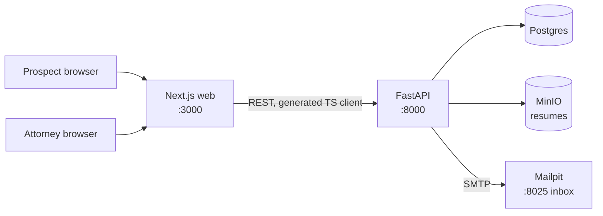
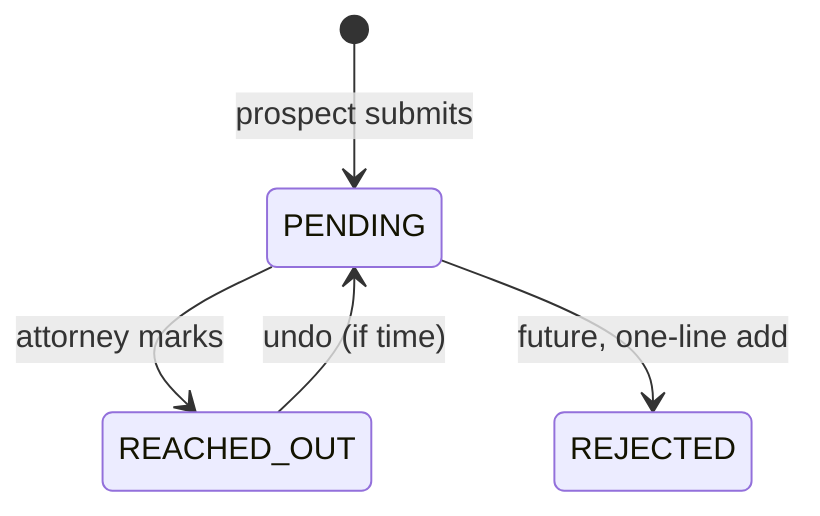
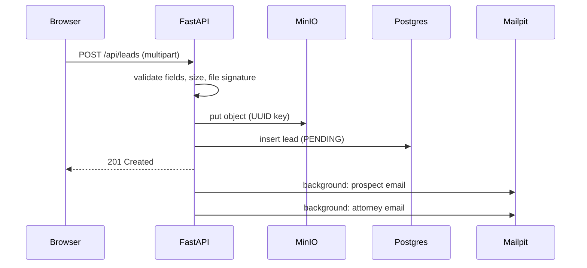

# Leads App — Design

> DRAFT: transcribed from the handoff by the agent. Rewrite the decisions in your own words before committing.

## Problem and scope

- A public form collects first name, last name, email, and a resume upload.
- On submit, the app emails the prospect and an attorney.
- A login-protected internal UI lists leads with everything the prospect submitted.
- Each lead starts `PENDING`; an attorney manually marks it `REACHED_OUT`.

Stack is fixed: FastAPI (API), Next.js (web), plus storage and an email service.

## Decisions

| Area | Decision | Why |
| --- | --- | --- |
| Auth | FastAPI owns auth: seeded attorney accounts, bcrypt-hashed passwords, JWT in an httpOnly cookie | One source of truth for who can see leads; the API is protected even if someone skips the UI |
| Email | Mailpit only (local SMTP catcher), behind an `EmailSender` interface | Runs anywhere with zero credentials; both emails visible in a web inbox for the demo |
| Resume storage | MinIO (S3-compatible) in docker-compose, behind a `StorageBackend` interface | Same API as S3, so production is a config change; files never touch the API container's disk |
| Database | Postgres + SQLAlchemy 2.x + Alembic | Real migrations; the schema will evolve |
| Email timing | Save the lead first, then send via FastAPI `BackgroundTasks` | A mail outage must never lose a lead; an outbox table is the production upgrade |
| State changes | One allowed-transitions map in the service layer. `PENDING → REACHED_OUT`, plus undo (`REACHED_OUT → PENDING`) if time allows. Anything not in the map returns `409` | New states like `REJECTED` become a one-line change; spec only requires two states |
| Audit | `lead_state_events` table: from, to, actor, timestamp, written on every transition | Undo, history, and "who marked this and when" from one mechanism |
| Attorney recipient | One configured address (`ATTORNEY_EMAIL` env var) | Assignment says "an attorney"; routing is a documented next step |
| Upload rules | PDF, DOC, DOCX only; 5 MB cap; type checked by file signature, not just extension; stored under a UUID key | Blocks spoofed files and path tricks; original filename kept only as metadata |
| Resume access | Attorneys download through the API (streamed or short-lived presigned URL) | MinIO is never publicly exposed |
| Public endpoint abuse | Documented, not built: rate limiting and a CAPTCHA | Worth naming; not worth 30 of 360 minutes |
| API contract | OpenAPI is the source of truth; frontend uses a generated TypeScript client | Lets backend and frontend agents work in parallel safely |
| Git and PRs | All work lands on `main` through PRs. Agents may branch, commit, push feature branches, open PRs, resolve conflicts. Agents never push to `main` and never merge | Every change gets a CI run and a bot review; the human keeps the final call |
| Attribution | Every commit ends with `Agent: claude-code`; human edits amend it to `Agent: mixed` or `Agent: hand-written` | Mechanical, so it never has to be reconstructed |

## Email: local-only on purpose

The app sends real email over SMTP, but to Mailpit, a local inbox that catches everything. Swapping to a real provider (Amazon SES, Postmark, SendGrid, Resend) is a config change, not a code change.

- **Reviewers can run it instantly.** No account, API key, or domain; `docker compose up` and it works.
- **No secrets in a public repo.** There's nothing to leak.
- **Real providers need a verified domain** (SPF, DKIM, DMARC). That's setup time, not engineering signal.
- **Better demo.** Both emails show up at `localhost:8025`.
- **Still real email.** Pointing at SES or Postmark means changing `SMTP_HOST`, `SMTP_PORT`, and credentials.

### Next steps for production

1. Pick a provider and verify a sending domain (SPF, DKIM, DMARC).
2. Move secrets into a secrets manager; nothing in `.env` files.
3. Replace `BackgroundTasks` with an outbox: save a `pending_emails` row in the same transaction as the lead; a worker sends and retries with backoff.
4. Handle bounces and complaints through the provider's webhooks.
5. Move templates to proper HTML templates with a plain-text fallback.
6. Route attorney notifications (round-robin or by practice area) instead of one inbox.

## System design

Five containers in docker-compose: Next.js, FastAPI, Postgres, MinIO, Mailpit.



Next.js proxies `/api/*` to FastAPI using `rewrites` in `next.config`, so the browser sees one origin. That avoids CORS setup and cross-port cookie issues. FastAPI still enforces auth on every internal route.

## Data model

| Table | Columns | Notes |
| --- | --- | --- |
| `leads` | `id` (UUID), `first_name`, `last_name`, `email`, `resume_key`, `resume_filename`, `resume_content_type`, `resume_size_bytes`, `state`, `created_at`, `updated_at` | Index on `(state, created_at DESC, id DESC)` for the dashboard list; email not unique, since a prospect may resubmit |
| `lead_state_events` | `id`, `lead_id` (FK), `from_state`, `to_state`, `actor_id` (FK to attorneys), `created_at` | One row per transition, written in the same DB transaction as the state change; index on `(lead_id, created_at)` |
| `attorneys` | `id`, `email` (unique), `password_hash`, `name`, `created_at` | Seeded by a script; no public signup |

UUID ids so lead URLs aren't guessable.

## API

| Method | Path | Auth | Purpose |
| --- | --- | --- | --- |
| POST | `/api/leads` | Public | Multipart form: fields + resume file; returns `201` |
| POST | `/api/auth/login` | Public | Sets httpOnly JWT cookie |
| POST | `/api/auth/logout` | Attorney | Clears cookie |
| GET | `/api/auth/me` | Attorney | Current attorney, for the UI |
| GET | `/api/leads?state=&limit=&offset=` | Attorney | Paginated list, newest first |
| GET | `/api/leads/{id}` | Attorney | One lead, with its state history |
| GET | `/api/leads/{id}/resume` | Attorney | Streams the file (or redirects to a short-lived presigned URL) |
| PATCH | `/api/leads/{id}` | Attorney | `{"state": "REACHED_OUT"}` (or `PENDING` for undo); `409` if the transition isn't allowed |
| GET | `/health` | Public | Liveness for compose healthchecks |

## State machine



All transitions live in one map in the service layer: `ALLOWED = {PENDING: {REACHED_OUT}, REACHED_OUT: {PENDING}}`. A transition not in the map returns `409`. State is a `varchar` validated by an app-level enum, so adding `REJECTED` later needs no migration.

## Submit flow



If the database insert fails after the upload, the service deletes the uploaded object. If email fails, the lead is already saved and the error is logged.

## Repo structure

```
alma-take-home/
├── CLAUDE.md              # agent rules
├── NOTES.md               # agent catches log + attribution
├── README.md              # how to run
├── docker-compose.yml     # web, api, db, minio, mailpit
├── Makefile               # make up / test / lint / seed / gen-client
├── .env.example
├── .claude/               # settings.json (hooks), hooks/, agents/reviewer.md
├── .github/workflows/     # CI + Claude PR review
├── docs/                  # DESIGN.md, AGENT_USAGE.md, prompt-logs/
├── backend/
│   ├── app/
│   │   ├── main.py, config.py, db.py
│   │   ├── models/        # SQLAlchemy tables
│   │   ├── schemas/       # Pydantic request/response shapes
│   │   ├── routers/       # leads.py, auth.py — HTTP only
│   │   ├── services/      # lead_service.py, auth_service.py — business logic
│   │   ├── storage/       # StorageBackend + MinIO implementation
│   │   └── email/         # EmailSender + SMTP implementation + templates
│   ├── alembic/
│   ├── scripts/seed_attorneys.py
│   └── tests/
└── frontend/
    ├── app/               # page.tsx (form), thank-you/, login/, dashboard/
    ├── lib/api/           # generated TS client — never hand-edited
    ├── middleware.ts      # redirect to /login if no session cookie
    └── e2e/               # Playwright tests
```

## Commit plan

Each commit: plan mode → approve → implement → `make test` + reviewer → manual check → commit.

| # | Commit | Automated check | Manual check |
| --- | --- | --- | --- |
| F1 | docs: design doc, CLAUDE.md, NOTES.md, .claude setup | Setup-verify: `/agents` lists reviewer, `/hooks` shows both hooks | Read DESIGN.md and edit the decisions in your own words |
| F2 | chore: compose, Makefile, skeletons, Next rewrites, CI | `make up`: all 5 services healthy | `localhost:3000` loads; `localhost:3000/api/health` returns 200; Mailpit at `:8025`; MinIO console at `:9001` |
| F3 | feat: models, migrations, schemas, route stubs, TS client | `make test` green | Swagger at `localhost:8000/docs` lists every route; `make gen-client` builds |
| — | PR 1 (foundation) | CI | Set up branch protection |
| B1 | feat(api): storage and email interfaces | Unit tests | A test email appears in Mailpit; a test object appears in MinIO |
| B2 | feat(api): public lead submission | Tests: bad fields, fake PDF, over 5 MB, email failure still returns 201 | Swagger: real PDF → 201 and two emails in Mailpit; renamed `.exe` → 422 |
| B3 | feat(api): attorney auth and seed script | Tests: 401 without cookie, 200 with | `make seed`; list leads → 401; log in → works |
| B4 | feat(api): list, detail, resume download, state transitions | Tests: pagination bounds, 404, allowed transition, 409, event row written | Mark a lead → 200; again → 409; download opens the PDF |
| — | PR 2 (backend) | CI + bot review | |
| W1 | feat(web): public form, thank-you page | `tsc`, eslint | Submit form → thank-you; server errors show under the right field |
| W2 | feat(web): login and auth middleware | `tsc`, eslint | `/dashboard` signed out → `/login`; log in → dashboard |
| W3 | feat(web): dashboard, detail, download, mark reached out | `tsc`, eslint | Full flow in the browser; button changes after marking |
| W4 | test(web): Playwright happy path | `make e2e` green | Watch it run once headed |
| — | PR 3 (frontend) | CI + bot review | |
| D1 | docs: README, DESIGN final, AGENT_USAGE, prompt logs | CI green | `docker compose down -v && make up`, then follow the README as a stranger would |

If behind, cut in this order: undo transition, state filter and pagination UI, W4 Playwright. Never cut D1 or the Loom.

## Testing

| Layer | When | What |
| --- | --- | --- |
| Lint and format | Every file edit | PostToolUse hook: ruff or eslint on that file |
| Fast tests | Every time the agent stops | Stop hook: `make test-fast` (unit tests + `tsc --noEmit`) |
| Full tests + review | Before each commit | `make test`, then the reviewer subagent on the diff |
| Manual check | Before each commit | The "Manual check" column above |
| CI | Every push to a PR | `ci.yml`: full suite in Docker |
| Bot review | Every push to a PR | `claude-code-review.yml` |
| Full E2E | Before merging PR 3 and before the Loom | `make e2e`, then the whole flow by hand from a clean stack |

The backend suite must cover: field validation, fake file type, size cap, email failure not failing the submit, upload cleanup when the DB insert fails, 401 on every internal route, pagination bounds, 404s, allowed transitions, 409 on disallowed ones, and an event row per transition.

## Future work

- Rate limiting and a CAPTCHA on `POST /api/leads`.
- Outbox table + worker for email (see production next steps above).
- Attorney routing instead of a single `ATTORNEY_EMAIL`.
- Additional states (`REJECTED`, `MOVED_ON`) — one line each in the enum and `ALLOWED` map.
